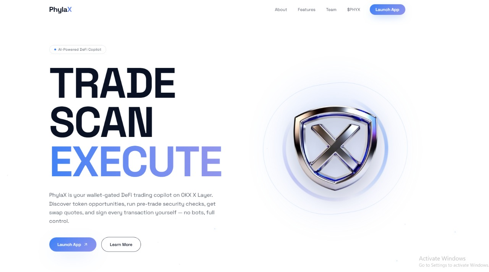

<div align="center">
  
</div>
> 🛡️ **Intent-based DeFi agent that scans tokens for risk, gets optimal swap quotes, and builds safe unsigned transactions on X Layer.**
> *Powered by OKX Agentic OS. Your wallet always signs.*

<div align="center">
  <b>Built for the Build X-Agent Hackathon</b> <br/>
  Participant ID: <code>2054917885347762176</code>
</div>

<br/>

**⚠️ Product Positioning:** PhylaX is a **human-in-the-loop** DeFi trading copilot. It is NOT a fully autonomous trading bot, nor is it production-ready for unsupervised live-money trading. The server prepares data and unsigned transactions, but the user wallet always executes the final signature.

---

## What It Does

You type: *"Swap 50 USDC to OKB on X Layer"*

PhylaX does:
1. **Parses your intent** via AI agent planning
2. **Scans both tokens** for honeypots & rug risks (OKX Security skill)
3. **Fetches optimal quote** across 500+ DEX routes (OKX DEX Swap skill)
4. **Checks allowance** and generates approval tx if needed
5. **Builds unsigned transaction** — server never broadcasts, you sign
6. **Confirms on-chain** after your wallet submits

> **Note:** For this hackathon, **X Layer is the only active executable chain.** Support for Base, BSC, and Solana are on the roadmap and coming soon.

---

## OKX Skills Integration

| Skill | What PhylaX Uses It For | CLI Command |
|---|---|---|
| `okx-dex-signal` | Discover trending tokens on X Layer | `onchainos signal list` |
| `okx-security` | Dual token risk scan before every trade | `onchainos security token-scan` |
| `okx-dex-swap` | Get quotes + build swap transactions | `onchainos swap quote` |
| `okx-dex-token` | Resolve token addresses by symbol | `onchainos token search` |
| `okx-wallet-portfolio` | Check wallet balances before execution | `onchainos portfolio token-balances` |
| `okx-onchain-gateway` | Gas estimation + transaction simulation | `onchainos gateway gas`, `gateway simulate` |
| `okx-agentic-wallet` | Wallet status and account info | `onchainos wallet status` |
| `okx-audit-log` | Audit log path for troubleshooting | Local path resolution |

---

## Why PhylaX Is Different

- **Agentic Proactive UX** — instead of a passive prompt-box, the agent proactively asks clarifying questions to guide users through swap intent formation.
- **DeepSeek & Claude Fallback** — built-in dual-LLM provider abstraction. Uses Anthropic Claude as primary, with automatic zero-downtime fallback to DeepSeek V4 if credits exhaust.
- **Dual token scan** — scans both `fromToken` AND `toToken` before any quote. Most agents scan only once.
- **Robust Token Resolution** — hardcoded shortcuts and decimal fallbacks for major assets (USDC, USDT, WETH) to prevent CLI ambiguity and execution failures.
- **No-broadcast guarantee** — `/api/execute` returns only unsigned `txData`. Server never touches your funds.
- **Approval replay prevention** — each approval ID is one-time use, expires in 5 minutes, consumed atomically via Redis.
- **Onchain tx verification** — verifies approval tx `from`, `to`, and method selector before proceeding to execution.
- **Kill switch** — operator can pause all live execution instantly via Redis flag `phylax:execution:paused`.
- **Hard cap enforced server-side** — `MAX_TRADE_USD_HARD_CAP` cannot be bypassed by the client.

---

## Demo Flow

```
User: "Swap 50 USDC to OKB on X Layer"

[Agent Plan]
  → parse intent: swap | USDC → OKB | X Layer | $50
  → scan fromToken: USDC ✅ LOW RISK
  → scan toToken: OKB ✅ LOW RISK  
  → quote: 50 USDC → 12.4 OKB | slippage 0.3% | gas ~$0.02
  → approval check: allowance sufficient ✅
  → build unsigned tx

[User]
  → reviews quote in UI
  → clicks confirm
  → wallet signs & broadcasts
  → PhylaX confirms on-chain ✅
```

---

## Architecture

```
User Intent (chat)
      ↓
AI Agent (Claude) — parseThesis + orchestrate()
      ↓
OKX Skills via onchainos CLI
  ├── okx-security    → dual token scan
  ├── okx-dex-signal  → token discovery  
  ├── okx-dex-swap    → quote + tx build
  ├── okx-dex-token   → symbol resolution
  └── okx-wallet-portfolio → balance check
      ↓
Approval Store (Redis) — one-time use, 5min expiry
      ↓
Risk Policy — slippage, hard cap, chain allowlist, kill switch
      ↓
Unsigned TX → returned to client
      ↓
User Wallet Signs & Broadcasts (Privy / MetaMask)
      ↓
/api/confirm — onchain verification
```

---

## Safety Model

| Guarantee | How |
|---|---|
| Server never signs/broadcasts | `/api/execute` returns unsigned `txData` only |
| No replay attacks | Approval IDs consumed atomically in Redis, one-time use |
| Honeypots blocked | OKX security scan, executionAllowed=false blocks trade |
| Budget protected | `MAX_TRADE_USD_HARD_CAP` enforced server-side |
| Quote freshness | Quotes expire after 2 minutes |
| Emergency stop | Redis kill switch pauses all execution instantly |
| Wallet binding | Approval tx sender verified on-chain before execution |

---

## Setup

```bash
git clone https://github.com/YOUR_USERNAME/phylax-okx-agent
cd phylax-okx-agent
npm install
cp .env.example .env.local
# Fill in: OKX_API_KEY, PRIVY credentials, DATABASE_URL, REDIS_URL
npm run dev
```

Open: http://localhost:3000

- OKX credentials: https://web3.okx.com/onchain-os/dev-portal
- Privy credentials: https://dashboard.privy.io

---

## Tech Stack

- **Next.js 16** — App Router, API routes, SSE streaming
- **Anthropic Claude & DeepSeek V4** — intent parsing, agent planning, tool orchestration with auto-fallback
- **OKX Onchain OS** — DEX routing, security scanning, signals
- **Privy** — embedded wallet + auth
- **Drizzle + Postgres** — audit log, sessions, approvals
- **Redis** — approval store, rate limiting, kill switch
- **Zod** — runtime schema validation

---

## Submission

**Participant ID:** `2054917885347762176`  
**Track:** Builder (code)  
**OKX Skills used:** `okx-dex-signal`, `okx-security`, `okx-dex-swap`, `okx-dex-token`, `okx-wallet-portfolio`, `okx-onchain-gateway`, `okx-agentic-wallet`, `okx-audit-log`  
**Demo Video:** [Watch on Loom](https://loom.com/share/phylax-demo) *(link will be updated before final submission)*

